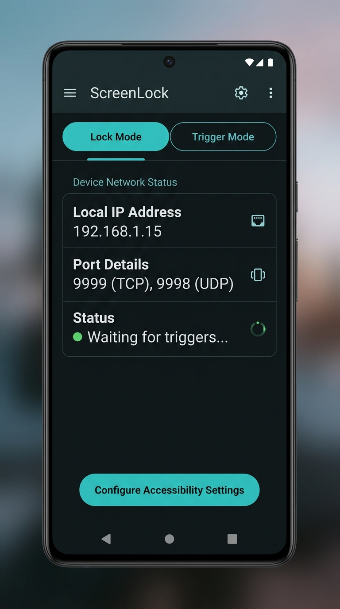
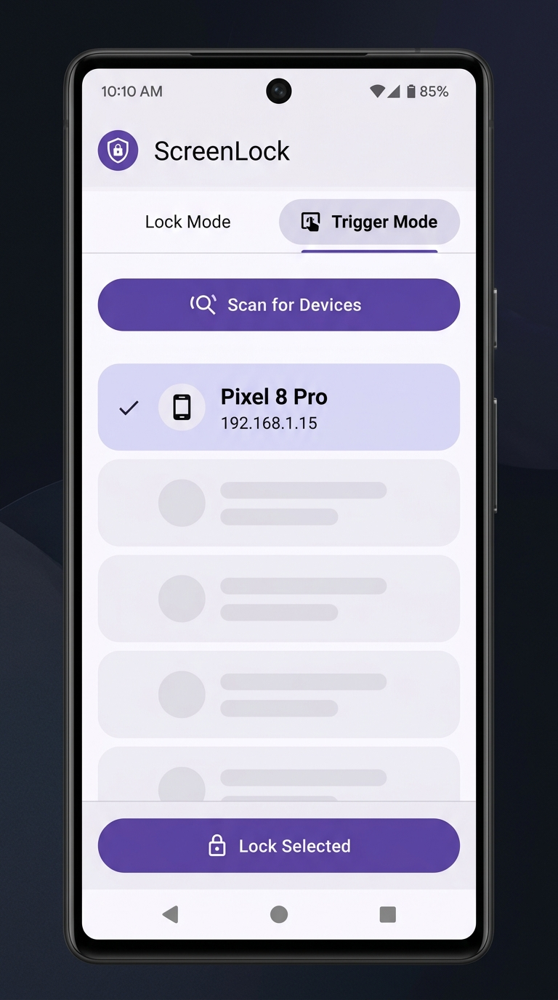

# ScreenLock

> [!NOTE]
> This project was created 100% with the Antigravity coding agent powered by Gemini 3.5 Flash.

An Android application that allows you to lock one Android device remotely from another device on the same local network. It works by utilizing a lightweight TCP/UDP networking layer and Android's Accessibility Service API.

## Screenshots

| Lock Mode | Trigger Mode |
|---|---|
|  |  |

## Features

The app operates in two modes:

1. **Lock Mode (Target Device)**
   - Acts as the receiver.
   - Starts a background **Accessibility Service** that listens on the local network.
   - Listens on **UDP Port 9998** for auto-discovery requests.
   - Listens on **TCP Port 9999** for incoming lock commands.
   - Automatically locks the screen when a valid command is received.

2. **Trigger Mode (Controller)**
   - Acts as the remote control.
   - Scans the local network via UDP broadcasts to automatically discover other devices running in **Lock Mode**.
   - Displays a list of discovered devices (Name & IP address).
   - Allows you to select a device and instantly lock its screen.

---

## How It Works

### UDP Discovery
- The controller sends a `"DISCOVER"` broadcast packet over UDP port `9998` to `255.255.255.255`.
- Target devices reply with `"LOCK_SERVICE_HERE:<device_name>"`.

### TCP Lock Command
- Once a target device is selected, the controller establishes a TCP connection to the target on port `9999`.
- The controller sends `"lock\n"`.
- The target device receives the command, triggers `GLOBAL_ACTION_LOCK_SCREEN` via its Accessibility Service, and responds with `"OK\n"`.

---

## Setup & Usage

### 1. Enable Accessibility Service (Target Device Only)
To allow the app to programmatically lock the screen:
1. Open the app and select **Lock Mode**.
2. Tap the **Settings** button to open the Android Accessibility Settings.
3. Find **ScreenLock Accessibility Service** in the list and enable it.

### 2. Lock a Device Remotely
1. Connect both devices to the same Wi-Fi network.
2. On the **Target Device**, open the app and set it to **Lock Mode**.
3. On the **Controller Device**, open the app and select **Trigger Mode**.
4. Tap **Scan** to find the target device.
5. Select the target device from the list and tap **Lock Selected**.

---

## Development & Building

### Requirements
- **JDK 17** (compatible with Gradle 8.10.2).
- Android Studio.

### Build via Command Line
To build the project manually, run the Gradle wrapper:

```bash
# Build debug and release APKs
./gradlew assembleDebug assembleRelease
```

The output APK files will be located in:
- `app/build/outputs/apk/debug/app-debug.apk`
- `app/build/outputs/apk/release/app-release.apk`

---

## GitHub Actions & Automated Releases

A CI/CD workflow is included at `.github/workflows/release.yml`. It automatically builds the application and publishes the APKs to a GitHub Release whenever a new tag is pushed.

To release a new version:
```bash
git tag v1.0.0
git push origin v1.0.0
```
